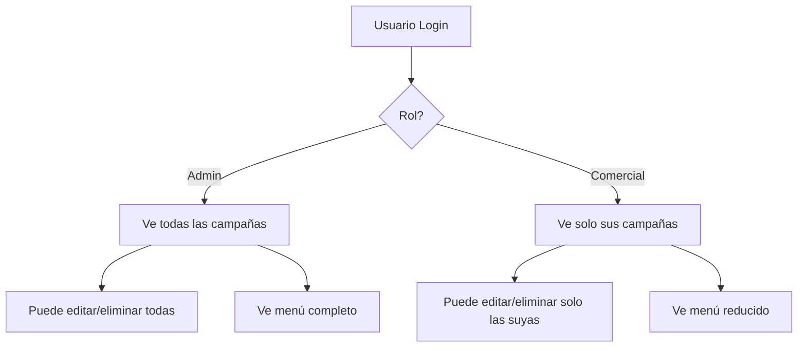

# Sistema de Roles - Comercial

## ✅ Implementación Completada

Se ha completado la implementación del rol **Comercial** con las siguientes funcionalidades:

### 🔐 Permisos del Rol Comercial

**Puede hacer:**

- ✅ Ver solo sus propias campañas (filtrado automático por `created_by`)
- ✅ Crear nuevas campañas
- ✅ Editar sus propias campañas
- ✅ Eliminar sus propias campañas
- ✅ Gestionar acciones de sus campañas
- ✅ Gestionar cuotas de sus campañas
- ✅ Ver detalles de sus campañas

**No puede hacer:**

- ❌ Ver campañas de otros comerciales
- ❌ Editar/eliminar campañas de otros
- ❌ Gestionar empresas, contactos, medios, canales, acciones (datos maestros)
- ❌ Ver estas opciones en el menú de navegación

### 📂 Archivos Modificados

#### Frontend:

1. **`src/types/index.ts`**
   - Actualizado tipo `User` para incluir `roles: string[]`
   - Compatible con respuesta del backend

2. **`src/utils/permissions.ts`** (NUEVO)
   - Funciones de verificación de permisos
   - `canEditCampaign()`, `canDeleteCampaign()`, etc.
   - `isAdmin()`, `isComercial()`, etc.

3. **`src/layouts/MainLayout.tsx`**
   - Navegación filtrada por permisos
   - Datos maestros solo visibles para admin
   - Muestra roles del usuario en el perfil

4. **`src/pages/CampaignsPage.tsx`**
   - Botones Editar/Eliminar ocultos si no tiene permisos
   - Validación de permisos por campaña individual

5. **`src/pages/CampaignDetailPage.tsx`**
   - Botón "Editar" oculto si no tiene permisos
   - Validación de permisos basada en `created_by`

#### Backend:

- Ya estaba implementado correctamente
- Filtrado automático por `created_by` para comerciales
- Middleware de roles funcional

### 🚀 Crear Usuario Comercial

**Opción 1: Script Node.js (Recomendado)**

```bash
cd GCD-api
node scripts/create-comercial-user.js
```

**Opción 2: API de Registro**

```bash
POST http://localhost:3000/api/auth/register
Content-Type: application/json

{
  "name": "Carlos",
  "surname": "Comercial",
  "email": "comercial@gcd.com",
  "password": "comercial123",
  "roles": [2]
}
```

**Credenciales:**

- Email: `comercial@gcd.com`
- Password: `comercial123`

### 🧪 Cómo Probar

1. **Crear usuario comercial** (ver arriba)

2. **Login como admin** (`admin@gcd.com` / `admin123`)
   - Ver todas las campañas
   - Ver todos los menús (empresas, contactos, etc.)
   - Crear campaña como admin

3. **Login como comercial** (`comercial@gcd.com` / `comercial123`)
   - Solo verás Dashboard y Campañas en el menú
   - Solo verás las campañas que tú hayas creado
   - Crear campaña como comercial
   - Intentar editar campaña del admin → Botón no aparece

4. **Volver a admin**
   - Ver ambas campañas (admin y comercial)
   - Poder editar ambas

### 🔄 Flujo de Trabajo



### 📊 Comparación de Permisos

| Funcionalidad                  | Admin | Comercial | Post-Venta | Analista |
| ------------------------------ | ----- | --------- | ---------- | -------- |
| Ver todas campañas             | ✅    | ❌        | 🔜         | 🔜       |
| Ver sus campañas               | ✅    | ✅        | ✅         | ✅       |
| Crear campañas                 | ✅    | ✅        | ❌         | ❌       |
| Editar cualquier campaña       | ✅    | ❌        | ❌         | ❌       |
| Editar sus campañas            | ✅    | ✅        | ❌         | ❌       |
| Gestionar datos maestros       | ✅    | ❌        | ❌         | ❌       |
| Actualizar estados de acciones | ✅    | ❌        | 🔜         | ❌       |
| Ver analytics                  | ✅    | ✅        | ✅         | ✅       |

✅ Implementado | ❌ No permitido | 🔜 Pendiente

### 🎯 Próximos Pasos

Ahora que el rol comercial está completo, los siguientes pasos serían:

1. **Post-venta** - Actualizar estados de acciones
2. **Contratos** - Subida de archivos PDF
3. **Notificaciones** - Sistema de alertas
4. **Analista** - Vistas de solo lectura con analytics

### 📝 Notas Técnicas

- El filtrado de campañas se hace en el **backend** → Seguro
- Los botones de UI se ocultan en el **frontend** → UX
- Los permisos se validan siempre en el backend
- El campo `created_by` en campaigns es clave
- Un usuario puede tener múltiples roles (array)

### 🐛 Troubleshooting

**Problema:** "No veo ninguna campaña como comercial"

- Solución: Crea una campaña logueado como ese comercial

**Problema:** "Veo campañas de otros"

- Solución: Verifica que el rol sea exactamente "comercial" (no "admin")

**Problema:** "El menú muestra todo"

- Solución: Asegúrate de que `user.roles` existe en el estado

**Problema:** "Error de autenticación"

- Solución: Verifica que el token incluya los roles en el JWT
